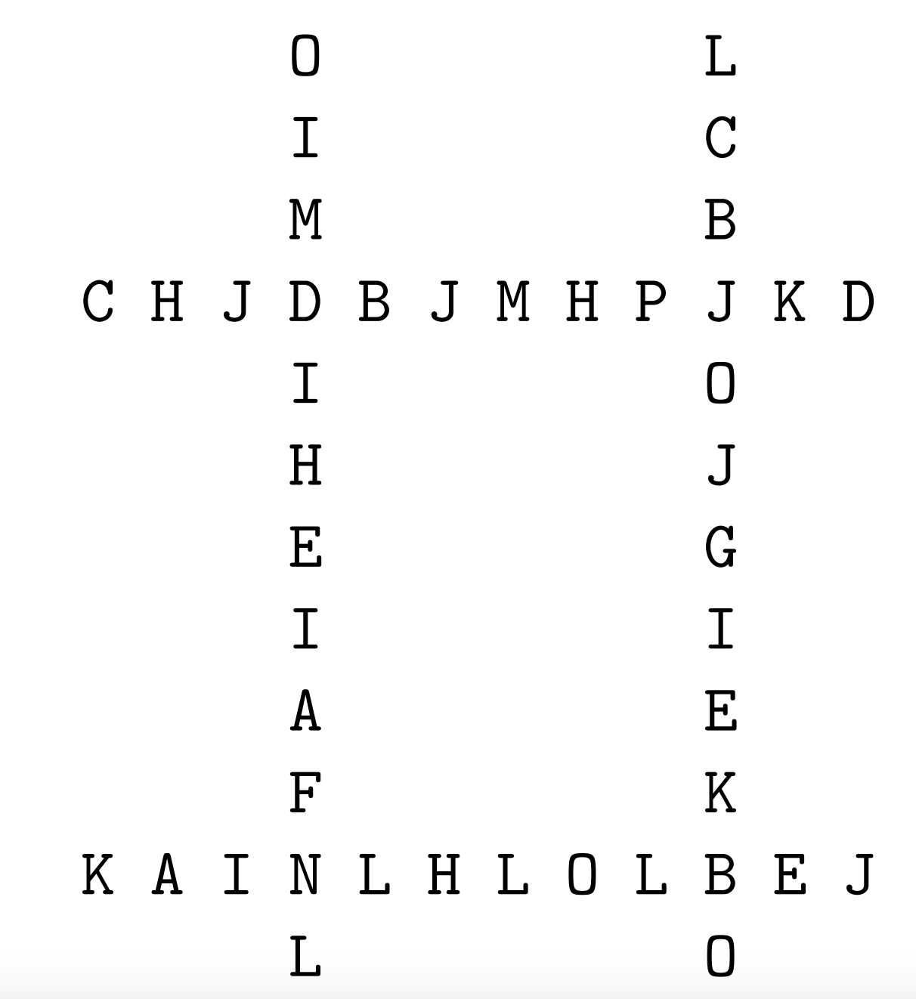
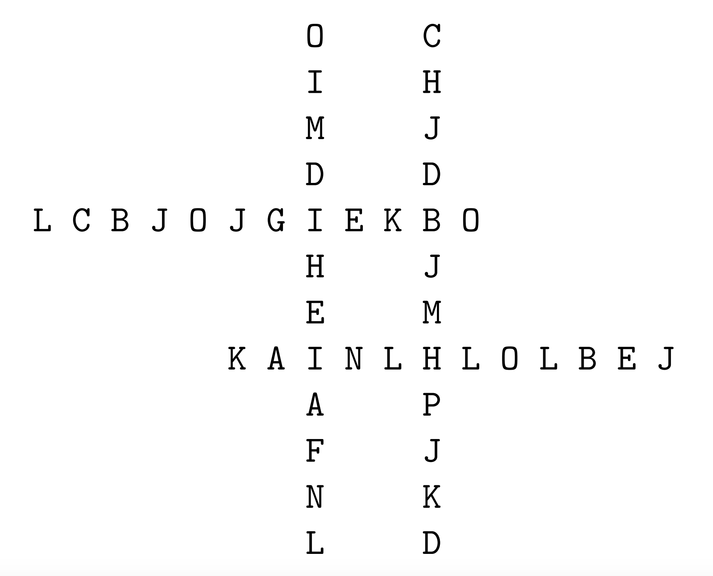

# Installation & Usage
No package manager is required. Run using python 3.6+

Usage: `python molecules.py <input-file> ?<expected-output-file>`

If an expected output file is given it will compare the output with it.

# Molecules
In this abstraction from a molecular engineering problem associated with developing a synthetic fuel, we are given four equal-length molecular chains that are to form a super molecule. In the simplified two-dimensional model used here, the super molecule is formed as an interlocking rectangular arrangement of the four given molecular chain strands. The interlocking feature is the sharing of a common molecule between pairs of chains. To illustrate, suppose we have the four length-twelve molecular chains:

```
O I M D I H E I A F N L
C H J D B J M H P J K D
L C B J O J G I E K B O
K A I N L H L O L B E J
```
These can be placed in the interlocking arrangements:



or



In this problem, we have some constraints on the arrangements being sought.

1. Any of the four chains can be placed in any of the super molecule's four general horizontal or vertical slots, as in the illustrations above.
1. If a chain is placed in one of the two horizontal slots, it must keep the same left-to-right orientation it had in the original chain listing. That is, it can't be flipped end-for-end.
1. If a chain is placed in one of the two vertical slots, its left-to-right orientation in the original chain listing must match its top-to-bottom orientation in the slot. It can't be flipped end-for-end from this orientation.
1. The enclosed rectangular region at the center of the super molecule must have as large an area as possible, and the area cannot be zero. (The large-area constraint arises from a fuel-volatility criterion for the arrangement. The non-zero area constraint arises because neither the vertically nor the horizontally oriented chains can lie immediately next to each other without producing side effects we're not considering.) The area is measured as the count of vacant character positions within the enclosed rectangle of the super molecule. The area counts of the two super molecules illustrated above are 30 and 4.
1. The fore and aft tails of each chain extending beyond the super molecule's central interlocked rectangle must have a minimum length of one chain element. That is, none of the four original chains can have either its first or its last element as part of the interlocking-rectangle boundary.
 

Input
The input consists of a series of data sets. Each data set consists of four molecular chains of 12 fixed elements each. These 12 elements are given as contiguous capital letters. The molecule designators within the chains will be restricted to the sixteen letters "A" through"P". The first letter of a chain will appear as the first character on an input line. The first molecule designator within the first chain of a data set will be the letter "Q" to indicate the end of data.

Output
A line with a single integer is to be emitted for each input data set encountered. This integer is the maximum area enclosed by any legitimate arrangement of the four chains. Use the output value 0 to indicate that no legitimate super molecule could be formed for a given data set. The first digit of an output value should be the first character on a line.